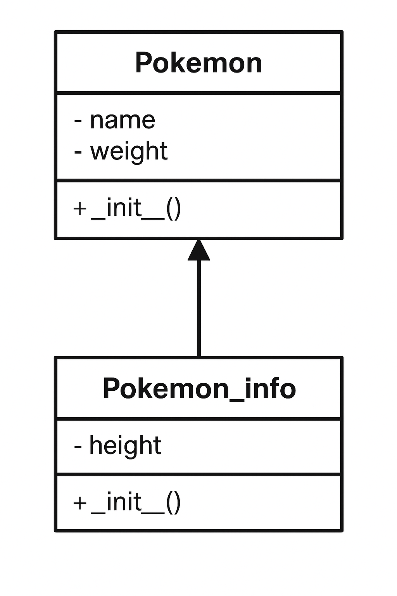

# Pokémon Vekt- og Høyde-Gjettespill

## Om prosjektet
Dette er et konsollspill hvor du skal gjette om en Pokémon veier mer enn en annen. Spillet henter data fra PokeAPI og gir deg poeng for riktige svar. Målet er å få høyest score som mulig.

## Funksjonalitet
- Henter Pokémon-data (navn, vekt, høyde) fra PokeAPI
- Sammenligner to Pokémon
- Brukeren gjetter om den første veier mer enn den andre
- Score-system
- Bruker farger og paneler med `rich`-biblioteket

## Objektorientert programmering
- Klasser: `Pokemon` og `Pokemon_info` (arver fra `Pokemon`)
- Arv brukes for å finne mer info om pokemonen 
- Koden er kommentert

## UML-diagram



## Utviklingsmetodikk

Vi har valgt **smidig utvikling** fordi:
- Vi kan endre og forbedre spillet underveis
- Lett å samarbeide og dele oppgaver


## Testing
- Vi har laget et test_ program for å se om klassene fungerer (se `test_pokemon.py`)

## Samarbeid og GitHub
- Repository opprettet av kim robbin og inviterte sezer
- Alle bidra med commits
- Brukte branches litt 

## Kjøring av spillet
1. Installer nødvendige pakker:
	```
	pip install requests rich
	```
2. Kjør `Hoved.py`:
	```
	python Hoved.py
	```

## Forbedringer
- Bedre feilhåndtering
- Ha flere gamemodes. Feks høyde, type og generasjon 

